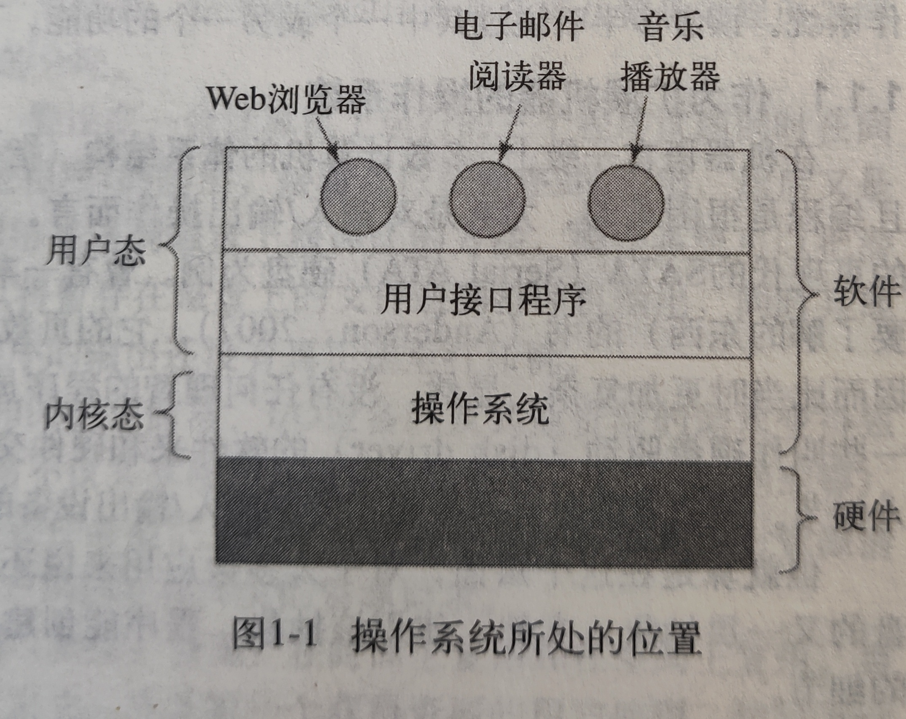

# 高频简答题

## C/C++语言特性


---


## 内存管理

### 使用类名+对象的实例化与使用new实例化对象有何区别？

```c++
class A{...}

int main()
{
    A a;//对象p1
    A* ptr=new A();//对象p2
}
```

p1 p2有何异同？

- p1由系统创建并释放，无需担心内存泄露的问题，但其生命周期局限于main（）函数中

- p2是指针，使用new申请的内存需要程序员自己来释放，在于操作者的能力，可以赋值给全局变量，还能把对象作为函数返回值（返回对象指针）

换言之：

- 存储空间不同，new申请的是堆内存，直接定义的在栈内存上
- 栈分配的空间在函数结束后会自己释放，而堆内存需要手动释放

两种创建对象方式的选择：

**如果对象本身所占内存很小，或者没有特殊的控制需要，则使用占内存**

- 效率高
- 不会产生内存碎片

**而对于在堆上分配，给程序员的自由度较高**

- 需要更多的控制管理，以实现程序的高效运行以及健壮性
- 使用new的好处：
  - 需要的时候才new
  - 对象可靠性检查
  - 对象的适度留用控制


---


## 计算机网络


---

## 数据库


----

## 数据结构与算法

### C语言实现环形缓冲区

> 简述环形缓冲区可以把它的读出端（以下简称R）和写入端（以下简称W）想象成是两个人在体育场跑道上追逐（R追W）。当R追上W的时候，就是缓冲区为空；当W追上R的时候（W比R多跑一圈），就是缓冲区满


**实现原理：**

环形缓冲区通常有一个读指针和一个写指针。读指针指向环形缓冲区中可读的数据，写指针指向环形缓冲区中可写的缓冲区。通过移动读指针和写指针就可以实现缓冲区的数据读取和写入。在通常情况下，环形缓冲区的读用户仅仅会影响读指针，而写用户仅仅会影响写指针。如果仅仅有一个读用户和一个写用户，那么不需要添加互斥保护机制就可以保证数据的正确性。如果有多个读写用户访问环形缓冲区，那么必须添加互斥保护机制来确保多个用户互斥访问环形缓冲区。

图1、图2和图3是一个环形缓冲区的运行示意图。图1是环形缓冲区的初始状态，可以看到读指针和写指针都指向第一个缓冲区处；图2是向环形缓冲区中添加了一个数据后的情况，可以看到写指针已经移动到数据块2的位置，而读指针没有移动；图3是环形缓冲区进行了读取和添加后的状态，可以看到环形缓冲区中已经添加了两个数据，已经读取了一个数据。


## 操作系统

### 内核态和用户态的区别

软件中最基础的部分是操作系统，它运行于**内核态**（**管态**、**核心态**）

在**内核态**中操作系统对于所有硬件有完全的访问权，可以执行机器能够运行的任何指令

软件其余部分运行在**用户态**

在**用户态**下，只使用了机器指令中的一个子集，**特别需要注意**，那些会影响机器控制或可进行I/O操作的指令，在用户态中是禁止的




### CPU状态之间的切换

**用户态--->内核态：**唯一途径是通过中断、异常、陷入机制（访管指令）

**内核态--->用户态：**设置程序状态字PSW


### 关于死锁

> 定义：如果一个进程集合中的每个进程都在等待只能由集合中的其他进程才能引发的事件，那么该进程就是死锁的

**资源死锁的条件：**

1. **互斥条件**：每个资源要么已经分配给了一个进程，要么就是可用的
2. **占有和等待条件**：已经得到了某个资源的进程可以再请求新的资源
3. **不可抢占条件**：已经分配给一个进程的资源不可强制性地被抢占 ，它只能被占有其的进程显示地释放
4. **环路等待条件**：死锁发生时，系统中一定有有两个或两个以上的进程所组成的一条环路，该换路中的每一个进程都在等待着下一个进程所占有的资源

**死锁预防的方法**：（破坏条件）

1. 互斥: 一切都使用假脱机技术
2. 占有和等待：在一开始就请求全部资源
3. 不可抢占：抢占资源
4. 环路等待：对资源按序编号